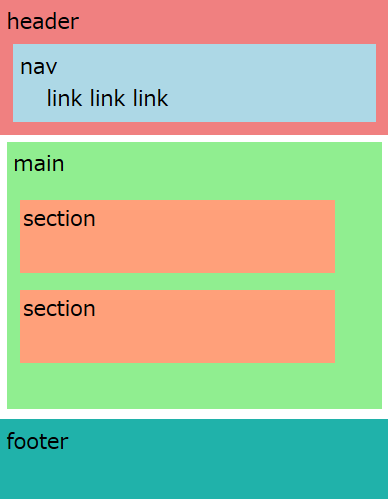

# html 構造編！

#### aタグ(アンカータグ)
別のサイトや、別ページ、同一ページの指定箇所にジャンプするタグです。
```

<!-- 同じサイト内の別ファイル -->
<p>会社概要ページに<a href="company.html">ジャンプ</a>します。</p>

<!-- web上の違うサイト -->
<p><a href="https://www.google.com/">Googleにジャンプします。</a></p>

<!-- web上の違うサイト(別タブ)  -->
<p><a href="https://www.google.com/" target="_blank" >Googleにジャンプします。</a></p>

<!-- 同じページ内の項目の見出しにジャンプ -->
<p><a href="#koumoku01">ジャンプ</a>します。</p>
<h2 id="koumoku01"></h2>

idとは？ 詳しくはcssでやりますが、Googleアカウントとかマイナンバーのイメージです。

問題！
company.htmlからindex.htmlにリンクするには？
```

#### コメント
```

<!-- ここにコメントがかけます -->

<!--  
  複数行もOk!
  ソースの内容や備考などを記載しましょう。
-->

```
#### パスについて
最初難しいと思うので、制作を通して、だんだん慣れましょう。

```
  ・相対パス
   ファイルの位置関係でリンクや画像パスを通す設定
    ・同じフォルダー(ディレクトリ)内にアクセスする・・・・ ファイル名を書く
    ・一つしたのフォルダー何にアクセスする・・・・ フォルダ名/ファイル名
    ・一つ上のフォルダーにアクセスする・・・・ ../ファイル名
   
  ・絶対パス
    urlなどを記述し、外部のサーバー(サイト)にパスを通す設定
```


# ここ大事！！！ HTML5タグでセクショニング




```
<header>
    <nav></nav>
</header>

<main>
<article>
    <section></section>
    <section></section>
    <section></section>
</article>
</main>
<footer></fotter>

<small>タグのコピーライトは&copy;</small>

コピーライトについて
https://liginc.co.jp/designer/archives/11313

実態参照一覧
https://mimi.moe.in/nmp/hms/cer

```


今までのをセクション内に移植する

#### divタグ
装飾のためのかこい
```
<div style="background-color:red;">
 <h3 style="background-color:skyblue;">小見出し01</h3>
 <p>ここに文章</p>
</div>
```
範囲や色を説明するために、いったんinlineスタイルでcssを指定 <br>
全体をdivで囲んで色つけてみたりする

#### spanタグ
一部だけ装飾を変更する
```
<div style="background-color:red;">
 <h3 style="background-color:skyblue;">小見出し<span style="background:red;">01</span></h3>
 <p>ここに文章</p>
</div>

```

#### emタグ、strongタグ
ページの中で5こずつ使用可能(強調)
```
<p>文章の中に<strong>重要な単語</strong>や<em>検索キーワード</em>がある場合はemやstrongを使いましょう。</p>

```


## ブロック要素とインライン要素
divとspanでブロック要素とインライン要素を説明 テキストと同じ動きがインライン要素、開業と同じ動きがブロック要素
改行されたらブロック要素、インライン要素はcssで横幅とか設定できない（ブロックにしなきゃ）
数的にインラインだけ覚えればOK
```
<a href="#">ページトップへ</a>
<a href="#">ページトップへ</a>

<p>ブロック</p>
<p>ブロック</p>
```

セクションでマークアップする課題を出す

#### 表の作成

```

<table border="1">
    <tr>
        <th>見出し01</th>
        <th>見出し02</th>
        <th>見出し03</th>
        <th>見出し04</th>
    </tr>
    <tr>
        <td>05</td>
        <td>06</td>
        <td colspan="2">07 08</td>
    </tr>
        <tr>
        <td>09</td>
        <td>10</td>
        <td>11</td>
        <td rowspan="2">12 16</td>
    </tr>
    </tr>
        <tr>
        <td>13</td>
        <td>14</td>
        <td>15</td>
    </tr>
</table>

```

#### フォーム（form）
```

<h1>お問い合わせフォーム</h1>
<form action="送り先" method="get or post">
  <p>
    <label for="onamae">お名前: <input type="text" name="oname" placeholder="デジハリ太郎"></label>
    <label>メール: <input type="text" name="email" placeholder="デジハリ花子"></label>
  </p>
  <p>
      <input type="radio" name="gender" value="m">: 男
      <input type="radio" name="gender" value="f">: 女
  </p>
  <p>
      <input type="checkbox" name="product" value="p01">: 商品１
      <input type="checkbox" name="product" value="p02">: 商品2
      <input type="checkbox" name="product" value="p03">: 商品3
  </p>
  <select>
      <option value="html5">HTML5</option>
      <option value="css">CSS</option>
      <option value="javascript" selected>JavaScript</option>
  </select>
  <p>
     <textarea name="mainText"></textarea>
  </p>
  <p>
      <input type="submit" value="送信">
  </p>
</form>
```
