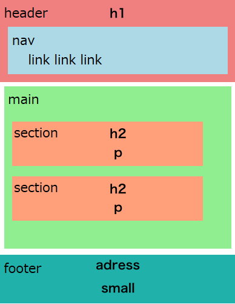

# html 構造編！

# ここ大事！！！ HTML5タグでセクショニング
HTMLではそれぞれのエリアの意味を定義して、セクションニングする必要があります。（検索エンジン対策）<br>

```
header: ヘッダー部分

nav : ナビゲーション部分

main: メインコンテンツ内容全域

article : 各記事やコンテンツの内容

aside : サイドバーなど

footer : フッター部分
```


```
<header>
    <nav></nav>
</header>

<main>
<article>
    <section></section>
    <section></section>
    <section></section>
</article>
</main>
<footer></fotter>

<small>タグのコピーライトは&copy;</small>


```

### 問題、この画像をセクショニングしてマークアップしてみましょう



```
使用テキスト

h1 DHW CAFE
nav <li><a href="#food">Food</a></l1>
h2 Food
 p 美味しいコーヒーを多数用意。バイヤーがこだわりの豆をセレクト
   くつろぎのひとときを。本も用意しています。
h2 Book
 p 小説や、雑誌など様々なジャンルを取り揃えています。

adress 湘南〜〜
small コピーライト

```

#### divタグ
特に意味を持たない装飾のための囲い
```
<div style="background-color:red;">
 装飾画像
</div>
```

#### spanタグ
一部だけ装飾を変更する
```
<div>
 <h3>ここに小見出し<span style="background:red;">01</span>が表示</h3>
</div>

```

#### emタグ、strongタグ
ページの中で5こずつ使用可能(強調)
```
<p>文章の中に<strong>重要な単語</strong>や<em>検索キーワード</em>がある場合はemやstrongを使いましょう。</p>

```


## ブロック要素とインライン要素 
指定しないと横幅100%なのがブロック要素。 テキストと同じ動きがインライン要素。<br>
インライン要素はcssで横幅とか設定できない（ブロック要素にしなければいけない）<br>
数的にインラインだけ覚えればOK cssの時に体感できると思います。<br>

```
<a href="#">ページトップへ</a>
<a href="#">ページトップへ</a>

<p>ブロック</p>
<p>ブロック</p>
```


#### tableタグ(表の作成)
集計結果などでまれに使います。
```

<table border="1">
    <tr>
        <th>見出し01</th>
        <th>見出し02</th>
        <th>見出し03</th>
        <th>見出し04</th>
    </tr>
    <tr>
        <td>05</td>
        <td>06</td>
        <td colspan="2">07 08</td>
    </tr>
        <tr>
        <td>09</td>
        <td>10</td>
        <td>11</td>
        <td rowspan="2">12 16</td>
    </tr>
    </tr>
        <tr>
        <td>13</td>
        <td>14</td>
        <td>15</td>
    </tr>
</table>

tableタグについて
https://udemy.benesse.co.jp/design/web-design/html-table.html
```

#### formタグ(フォーム)
```

<h1>お問い合わせフォーム</h1>
<form action="送り先" method="get or post">
  <p>
    <label for="onamae">お名前: <input type="text" name="oname" placeholder="デジハリ太郎"></label>
    <label>メール: <input type="text" name="email" placeholder="デジハリ花子"></label>
  </p>
  <p>
      <input type="radio" name="gender" value="m">: 男
      <input type="radio" name="gender" value="f">: 女
  </p>
  <p>
      <input type="checkbox" name="product" value="p01">: 商品１
      <input type="checkbox" name="product" value="p02">: 商品2
      <input type="checkbox" name="product" value="p03">: 商品3
  </p>
  <select>
      <option value="html5">HTML5</option>
      <option value="css">CSS</option>
      <option value="javascript" selected>JavaScript</option>
  </select>
  <p>
     <textarea name="mainText"></textarea>
  </p>
  <p>
      <input type="submit" value="送信">
  </p>
</form>

フォームタグについて
https://www.sejuku.net/blog/81862
```

### コピーライトや実態参照について
コピーライトについて
https://liginc.co.jp/designer/archives/11313
実態参照一覧
https://mimi.moe.in/nmp/hms/cer


## 階層構造
基本的にwebサイトを作る時の階層構造はこのようにして制作します。<br>
 <br>


#### パスについて
最初難しいと思うので、制作を通して、だんだん慣れましょう。

```
  ・相対パス
   ファイルの位置関係でリンクや画像パスを通す設定
    ・同じフォルダー(ディレクトリ)内にアクセスする・・・・ ファイル名を書く
    ・一つしたのフォルダー何にアクセスする・・・・ フォルダ名/ファイル名
    ・一つ上のフォルダーにアクセスする・・・・ ../ファイル名
   
  ・絶対パス
    urlなどを記述し、外部のサーバー(サイト)にパスを通す設定
```
